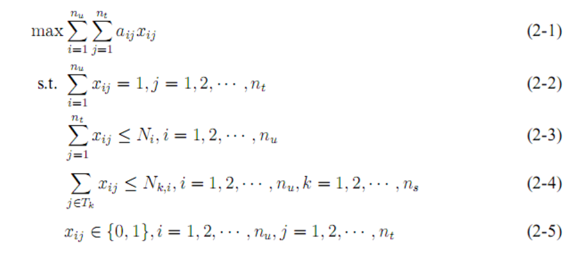
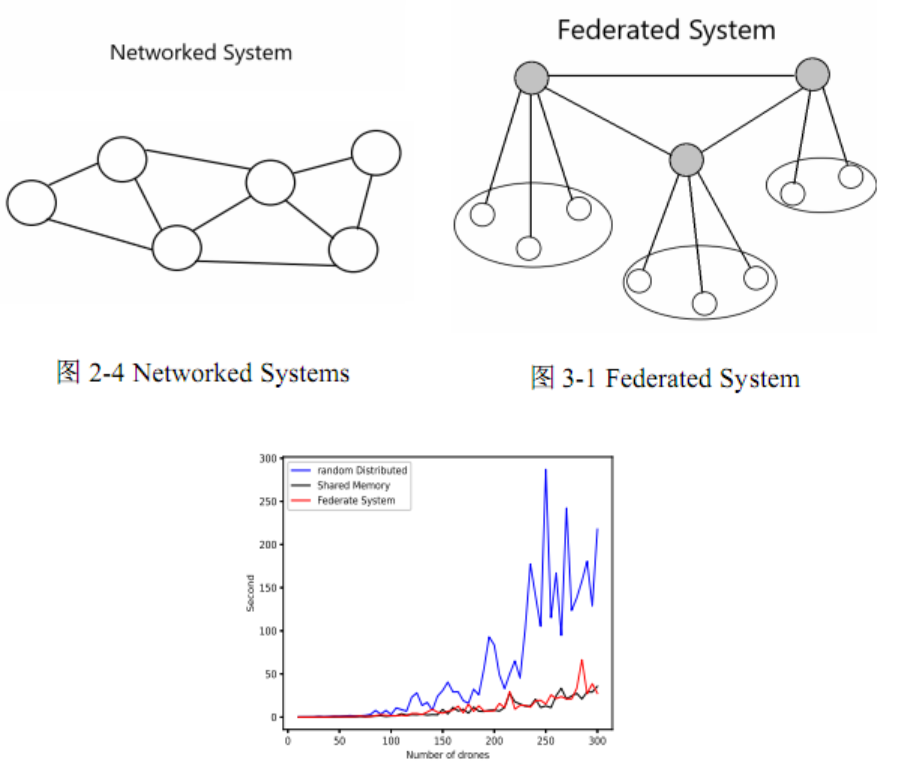

### Distribution-Auction-Algorithm-based-UAV-Swarm-Task-Assignment 基于分布式拍卖算法的无人机集群任务分配

``src`` file is the source file, which contains the code on Distribution-Auction-Algorithm under different network topologies.

#### Problem Formulation

$x_{ij} =1 $ means the task $i$ is assigned to uav $j$ with $a_{ij}$ is the return, $N_{i} $ is the maximum number of tasks that $i$ is assigned, $N_{ki} $ denotes the maximum number of tasks belongint to task set $T_k$ for uav $i$.

#### Simulation

